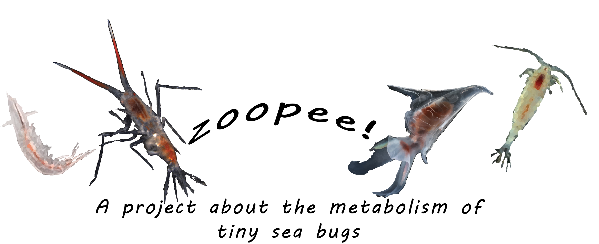

# zoopee
This is the repository for my work on zooplankton excreta (pee!) with Amy Maas. It forms Chapter 3 of my thesis, "On the non-microbial sources and sinks of dissolved metabolites in seawater."

## Usage and Contents
Hi there! This is where I store the most updated codes for processing targeted metabolomics experiments concerning what zooplankton excrete into the water around them.

### Concerning Raw Data
If you're reading this, I suggest you take a look at my thesis to get a sense for what the objectives are. You can find the data for this chapter at [MetaboLights](https://www.ebi.ac.uk/metabolights/editor/study/MTBLS9061), but if you don't want to process raw LC-MS data, I get it. The processed metabolite concentrations are in the datafile `datasets/zoopee_OneMode.mat`.

In the case where you want to use the raw data, see my notes [here](https://github.com/germo006/Chemstation-S) about the additional code you need. 

### Processing and Graphing
By far the most essential script is `code/Analysis_v3.m`. This pairs some nicely-formatted metabolite names with the data, does some filtering, and produces all the essential figures for the manuscript. It also scrapes relevant metadata that's included in the `data/` directory and pulls in some auxilliary data about bulk carbon and nitrogen in our incubations. 

One code that you might struggle with is `FieldRates.m`. This uses additional data taken from [Maas et al. (2021)](doi:10.1093/plankt/fbab037), which I have included in the `data/` directory. However, there is an option within the script that pulls in data from [this repository](https://github.com/germo006/Chemstation-S). The thesis was sort of interconnected, and so the type of figures produced by this code were actually part of a different chapter. To make this only use data from this repository, find the line:
```
%%If you really wanna get nuts with it
``` 
and set the flag below to `0`. This is the case where you do not, in fact, want to get nuts with it. 

## I don't have MATLAB.
As with the rest of my thesis, it's basically all MATLAB, so my apologies to any of you who see the irony in my creating a public repository and posting code that can only be run in a proprietary environment. C'est la vie.
